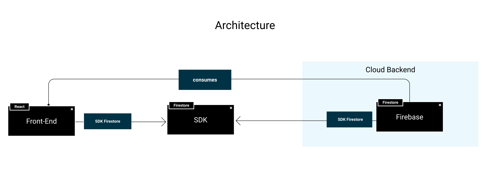

# Proyecto Web - React + Firebase

## Prototipo

Una versión interactiva del proyecto se puede encontrar en la [Página de Figma](https://www.figma.com/proto/3e43h8TrzwpjfKwXvFxZoP/Taller?page-id=144%3A51&node-id=147%3A3&viewport=254%2C48%2C0.21&scaling=min-zoom&starting-point-node-id=147%3A3).

Además, como se enseñará en el propio proyecto, podemos ver el prototipo final en [este link](https://taller-threepoints-1.netlify.app/)

## Setup

Para poner en marcha el proyecto tenemos que seguir los pasos detallados en el [CONTRIBUTING.md](CONTRIBUTING.MD)

## Tecnologías

Este proyecto cuenta con las siguientes tecnologías, que se encuentran dentro del prototipo.

### UI

* [React](https://reactjs.org/docs/hello-world.html)
* [Create React App](https://create-react-app.dev)
* [Styled Components](https://styled-components.com)
* [Internationalization](https://react.i18next.com)
* [Lottie](https://lottiefiles.com/blog/working-with-lottie/how-to-use-lottie-in-react-app)
* [React Router](https://reactrouter.com/web/guides/quick-start)
* [Typescript](https://www.typescriptlang.org)
* [Swagger](https://swagger.io)
* [Figma](https://www.figma.com)
* [JWT](https://jwt.io)
* [Fetch](https://developer.mozilla.org/en-US/docs/Web/API/Fetch_API)
* [DotEnv](https://github.com/motdotla/dotenv)

### Backend

* [Firebase](https://firebase.google.com)

### BBDD

* [Cloud Firestore](https://firebase.google.com/docs/firestore)
